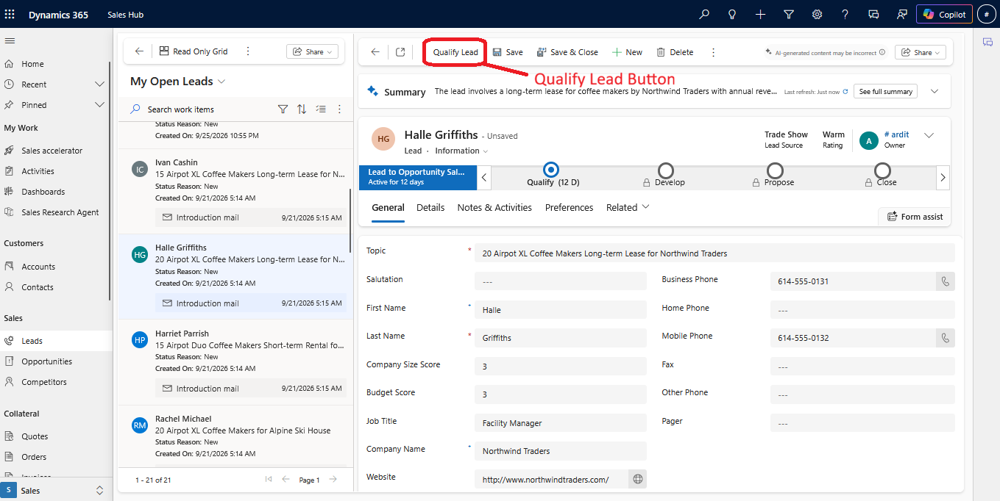
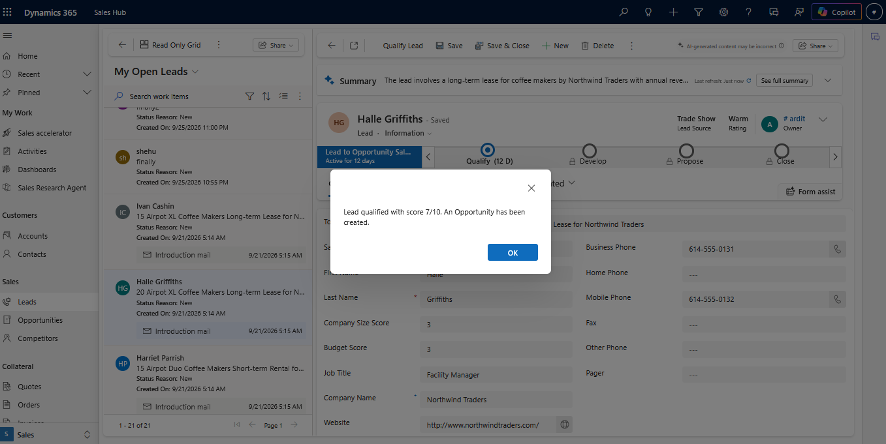
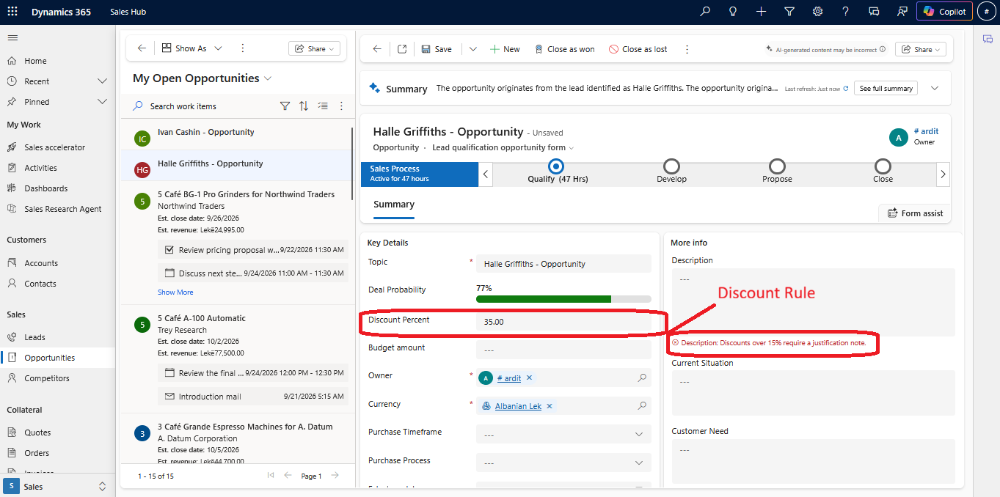
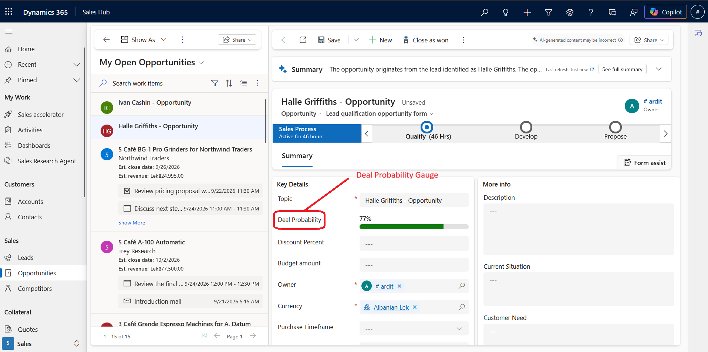
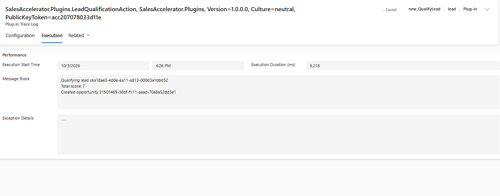
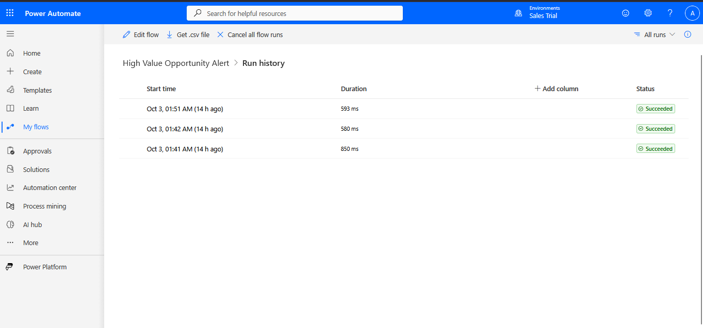
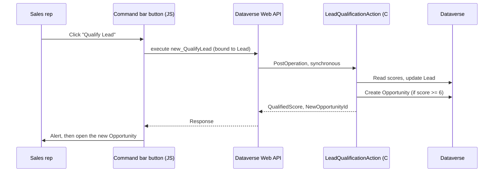

# Sales Accelerator: Dynamics 365 Sales & Power Platform

A hands-on Dynamics 365 Sales / Power Platform project covering lead qualification and discount governance. It was built end to end in a trial environment and uses Dataverse customization, C# plugins, a custom action, JavaScript web resources, a TypeScript PCF control and a Power Automate flow.

> **Status:** personal learning project, built and tested in a Dynamics 365 Sales trial environment. It is not client work and it is not production-hardened (see [Limitations](#limitations-and-next-steps)).

## What it does

1. **Qualify Lead button.** A command-bar button on the Lead form calls a custom action through the Web API. A C# plugin scores the lead (company size + budget + engagement) and, at a score of 6 or more, creates an Opportunity and opens it.
   
   

2. **Discount governance.** Discounts over 15% need a justification in the Description. JavaScript gives instant feedback on the form, and a server-side plugin enforces the same rule for any save, including API calls and imports.
   

3. **Deal probability gauge.** A custom PCF control (TypeScript) replaces the plain number box for _Deal Probability_ with a clickable red/amber/green bar.
   

4. **High-value deal flag.** A Power Automate flow fires when an Opportunity over 50,000 is created and writes an alert back onto the record.




## Where each skill shows up

| Skill                                                                                | Where                                                                                  |
| ------------------------------------------------------------------------------------ | -------------------------------------------------------------------------------------- |
| Tables, columns, forms, business rules                                               | [docs/01-data-model.md](docs/01-data-model.md)                                         |
| C# plugins: Pre/PostOperation, pre-images, Sandbox, tracing                          | [plugins/](plugins/SalesAccelerator.Plugins), [docs/02-plugins.md](docs/02-plugins.md) |
| Custom action (definition + plugin implementation)                                   | [docs/03-custom-action.md](docs/03-custom-action.md)                                   |
| JavaScript web resources, form events, Web API from the client                       | [web-resources/](web-resources), [docs/04-web-resources.md](docs/04-web-resources.md)  |
| PCF control in TypeScript                                                            | [pcf/](pcf/DealProbabilityGauge), [docs/05-pcf-control.md](docs/05-pcf-control.md)     |
| Power Automate (Dataverse trigger, filter rows)                                      | [docs/06-power-automate-flow.md](docs/06-power-automate-flow.md)                       |
| Debugging: plugin trace log, Plugin Registration Tool, Event Viewer, browser console | [docs/PROBLEMS-AND-FIXES.md](docs/PROBLEMS-AND-FIXES.md)                               |

## How it fits together



## Repository layout

```
.
├── docs/                         # setup notes + PROBLEMS-AND-FIXES.md
├── plugins/SalesAccelerator.Plugins/
│   ├── DiscountValidationPlugin.cs   # Opportunity Create/Update (PreOperation)
│   ├── LeadQualificationAction.cs    # new_QualifyLead custom action logic
│   └── HelloWorldPlugin.cs           # smoke test used to validate the registration pipeline
├── web-resources/
│   ├── opportunity_form.js           # discount justification warning
│   └── lead_ribbon_button.js         # calls the custom action
└── pcf/DealProbabilityGauge/         # PCF project (TypeScript)
```

<!-- ## Setup

**Prerequisites:** a Dynamics 365 Sales environment with the Sales Hub app, Visual Studio 2022 (".NET desktop development" workload), Node.js, the Power Platform CLI (`winget install --id Microsoft.PowerAppsCLI -e`) and the Plugin Registration Tool.

Deploy in this order (details in `docs/`):

1. Create the solution, columns, forms and business rule. See [01-data-model](docs/01-data-model.md).
2. Define the `new_QualifyLead` custom action. See [03-custom-action](docs/03-custom-action.md).
3. Build the plugin assembly (.NET Framework 4.6.2 class library, signed) and register it. See [02-plugins](docs/02-plugins.md).
4. Upload the web resources and wire the form events. See [04-web-resources](docs/04-web-resources.md).
5. Add the command-bar button to the Lead form. See [04-web-resources](docs/04-web-resources.md).
6. Build and push the PCF control. See [05-pcf-control](docs/05-pcf-control.md).
7. Build the flow. See [06-power-automate-flow](docs/06-power-automate-flow.md). -->

<!-- ## Design decisions

- **Validation at two layers.** Client JavaScript gives immediate feedback, and the plugin is the real enforcement point because anything that bypasses the form (API, import, flow) still hits it.
- **Pre-image on Update.** An Update only carries changed columns, so the plugin reads the old Description from a pre-image when only the discount changed.
- **Typed output parameters.** The action returns `NewOpportunityId` as an `EntityReference` and `QualifiedScore` as an integer, so the caller gets a usable record link instead of a bare GUID.
- **Sandbox isolation.** Plugins are registered in Sandbox mode, as required in Dataverse online. -->

<!-- ## Problems I hit and how I fixed them -->

<!-- Most of the learning in this project came from things that broke. Highlights below; the full write-up with symptoms, causes and fixes is in **[docs/PROBLEMS-AND-FIXES.md](docs/PROBLEMS-AND-FIXES.md)**.

| Symptom                                                        | Root cause                                                                                                                               | Fix                                                                                                               |
| -------------------------------------------------------------- | ---------------------------------------------------------------------------------------------------------------------------------------- | ----------------------------------------------------------------------------------------------------------------- |
| Plugin never fired; trace log empty                            | Plugin registered in a different environment than the one I tested in                                                                    | Compared Instance URLs in _Session details_; reconnected the Plugin Registration Tool to the right org and region |
| Custom action returned score `0` with no error                 | Step registered on message `QualifyLead` instead of `new_QualifyLead`, so nothing was listening and the platform returned empty defaults | Re-registered the step by picking the message from autocomplete                                                   |
| Dialog said _"Invalid Argument"_                               | `new_qualified` was created as Whole Number; the plugin wrote a boolean                                                                  | Read **Exception Details** in the Plugin Trace Log, recreated the column as Yes/No                                |
| UI said "below threshold" though an Opportunity was created    | The Web API returns the lookup as `{ opportunityid: ... }`, not `{ id: ... }`                                                            | Logged the real payload in the browser console and fixed the property name                                        |
| Field warning blocked saving even after typing a justification | The notification was only cleared when the discount dropped, and never re-checked on Description changes                                 | Warn only when discount > 15 **and** Description is empty; added an OnChange handler on Description               |
| `Message Create does not support this image type`              | Pre-images don't exist on Create                                                                                                         | Registered the pre-image only on the Update step                                                                  |
| Form changes never appeared                                    | Edited a Main form that was switched off, and tested in the wrong app                                                                    | Edited the active form and tested in Sales Hub                                                                    |
| `pac pcf push` crashed with `XmlException`                     | Stray comment after `</manifest>` made the manifest invalid XML                                                                          | Removed it                                                                                                        | -->

## Limitations and next steps

- Not exported as a solution file yet, and there is no ALM pipeline. Everything lives in one trial environment.
- No automated tests. Plugin logic could be covered with a mocking framework such as FakeXrmEasy.
- The qualify action isn't idempotent: running it twice on a qualifying lead creates two Opportunities.
- Scoring weights and the threshold (6) are hard-coded.
- The flow only handles _new_ Opportunities. Catching an existing one that crosses 50,000 on update would need "Added or Modified" plus old/new value comparison. It writes an alert to the record rather than sending email or a Teams message, because the trial tenant had no mailbox for the Outlook connector.
- The original declarative business rule ("Discount Justification Required") was deactivated once the JavaScript and plugin versions existed, so only one mechanism enforces each behaviour.
- Not covered: SharePoint, Business Central or Azure integrations, and the Customer Service, Field Service and Marketing modules.
